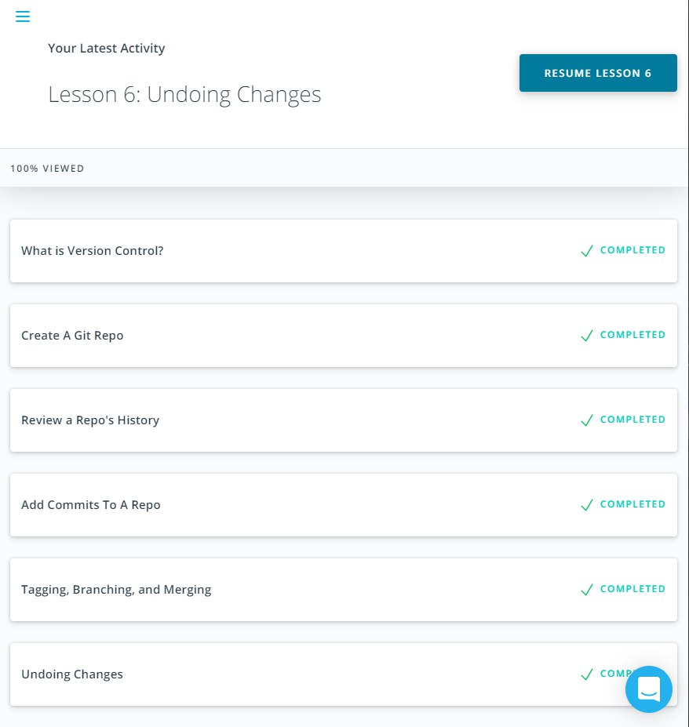
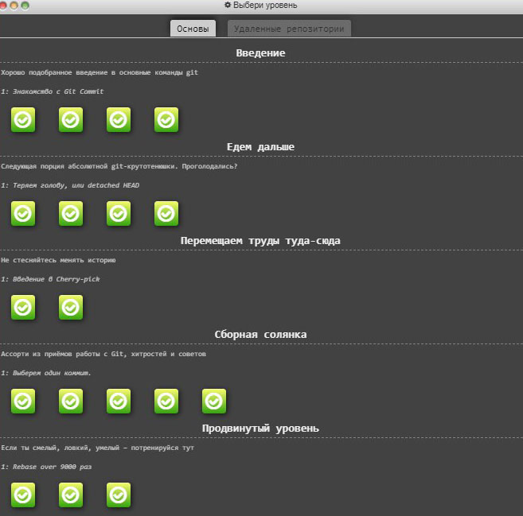
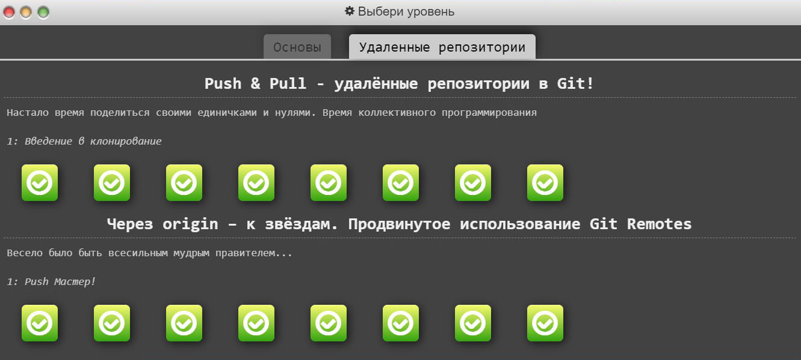

# kottans-frontend 

# 1. Git and GitHub intro  
 For me, these courses were very informative and now I understand the principles of git much better. 
 I've lerned how to use cherry-pick and git log correctly.
 
 
 
